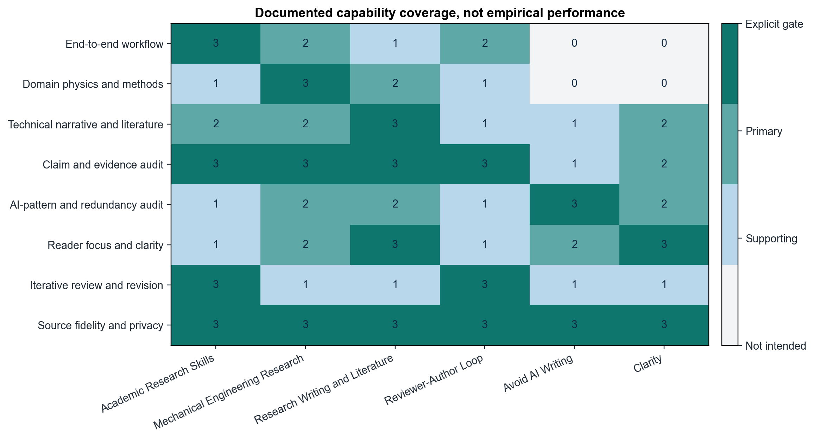
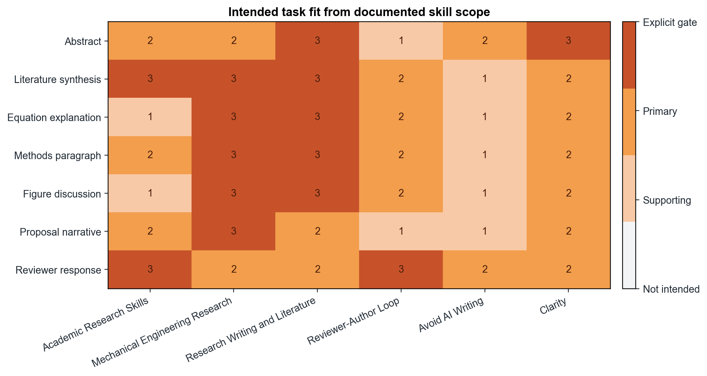
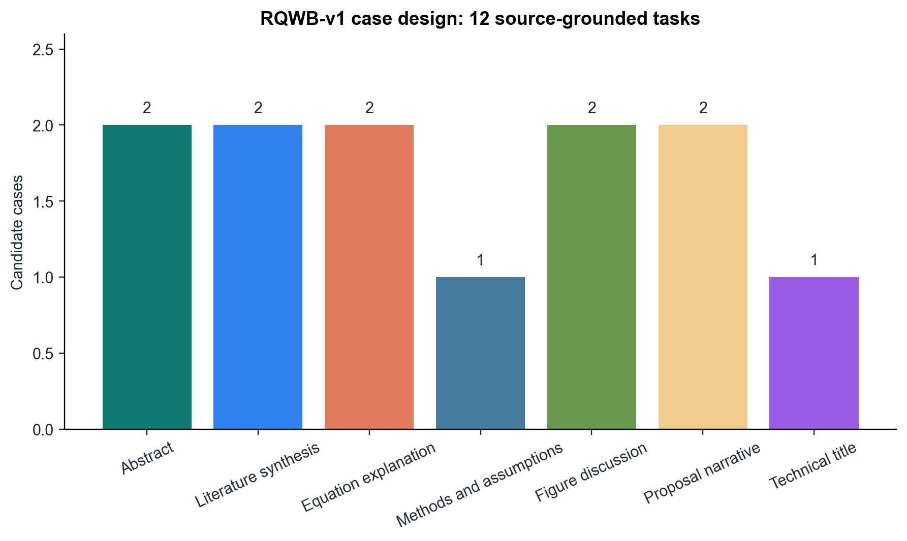
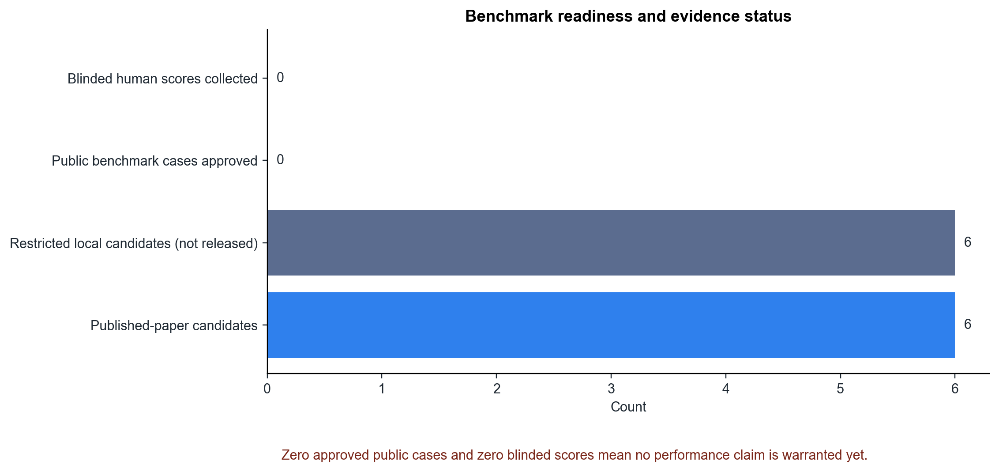
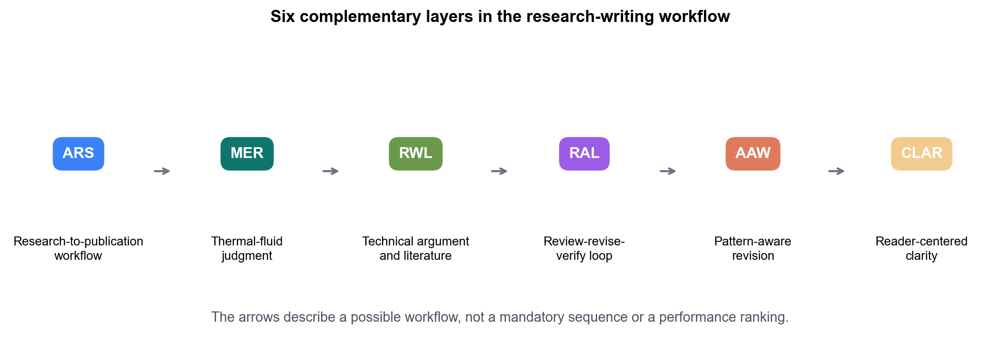

# RQWB Capability Report

## Scope

This public report compares six complementary skills by their documented intended functions. It is a benchmark-readiness artifact, not an outcome-performance evaluation. The 0-3 scores in the heatmaps represent the explicitness of instruction coverage. It contains no manuscript, proposal, student, reviewer, or source-packet content.

| Score | Meaning |
| ---: | --- |
| 0 | Not an intended function |
| 1 | Supporting guidance |
| 2 | Primary function |
| 3 | Explicit workflow or verification gate |

## Skills Compared

| ID | Skill | Intended role | Appropriate claim now |
| --- | --- | --- | --- |
| ARS | Academic Research Skills | End-to-end academic workflow scaffold | It structures research-to-publication work and integrity checkpoints. |
| MER | Mechanical Engineering Research | Domain coordinator and scientific-integrity gate | It brings physical assumptions, methods, evidence, and validity ranges into the workflow. |
| RWL | Research Writing and Literature | Technical narrative, literature, and argument layer | It directs literature synthesis, figure-led discussion, and technical-argument checks. |
| RAL | Reviewer-Author Loop | Iterative critique, revision, and verification | It provides a reviewer, author, verifier, and re-review process. |
| AAW | Avoid AI Writing | Pattern-aware, source-preserving edit | It identifies AI-associated patterns without treating them as authorship proof. |
| CLAR | Clarity | Reader-centered prose and source fidelity | It focuses on what a reader can understand while preserving source-grounded meaning. |

## Figures

1. `01_documented_capability_heatmap.png`: compares documented coverage across eight workflow capabilities.
2. `02_intended_task_fit_heatmap.png`: maps documented task fit across seven benchmark genres.
3. `03_case_design.png`: shows the 12-case benchmark design.
4. `04_benchmark_readiness.png`: distinguishes candidate availability from actual evaluation evidence.
5. `05_complementary_workflow_map.png`: explains why these tools should be composed rather than ranked as substitutes.

## Tables To Use In The LinkedIn Article

### Table A. What Each Skill Fixes

| Writing failure | Most relevant layer | Why |
| --- | --- | --- |
| A paper moves from topic to topic without a research story. | ARS | Provides a staged workflow from research through revision. |
| A technically fluent paragraph omits the mechanism or validity range. | MER and RWL | Checks physical meaning, evidence, and argument structure. |
| An equation explanation lists variables instead of describing the force, energy, or transport balance. | RWL with MER | Requires the governing physics and assumptions to be named. |
| A draft repeats generic language such as “enables” or “establishes.” | AAW | Identifies patterns for contextual review. |
| A sentence is correct but readers cannot identify its point. | CLAR | Rebuilds the sentence around reader outcome and source meaning. |
| A revision responds cosmetically to a reviewer without resolving the issue. | RAL | Requires author action and verification against acceptance criteria. |

### Table B. What Cannot Yet Be Claimed

| Claim | Status | Evidence still required |
| --- | --- | --- |
| One skill produces better technical writing than another. | Not evaluated. | Blinded ratings of matched outputs. |
| The integrated workflow improves research-writing quality. | Not evaluated. | Baseline versus integrated comparison across approved cases. |
| The workflow makes text human or undetectable. | Out of scope. | The benchmark does not evaluate authorship or detector evasion. |

## Pilot Execution Plan

1. Freeze a case packet, source boundary, model/version, prompting, and sampling settings.
2. Generate B0 baseline and B5 integrated-workflow outputs without access to the protected reference answer.
3. Blind outputs and obtain at least two technical ratings.
4. Record rubric scores, unsupported-claim counts, citation errors, and human editing time.
5. Report distributions and disagreement, not a single composite score.
